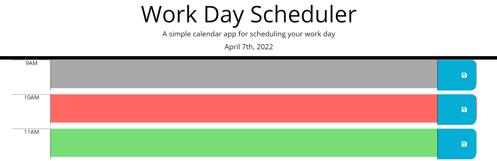

# time-management-planner

## Description:
This app is a daily planner intended for students, workers, and all with busy schedules.

## Contributors
I wrote the code, but received help from classmate Sam.  Also utilized the services of BCS Tutors Shaun and Royce.  In addition, I also went to office hours to get help from my instructor John and class TA Michael.

## Usage
To use this app, you can access it at click on a text box to write down a plan.  If you then hit the save button, the note will be saved in local storage.  In addition, it is color coded.  Gray means this hour has happened, green means its in the future, and red is for the present hour.  You can see examples of all three colors in the screenshot below.

## License
Matt Carlson Code 2022